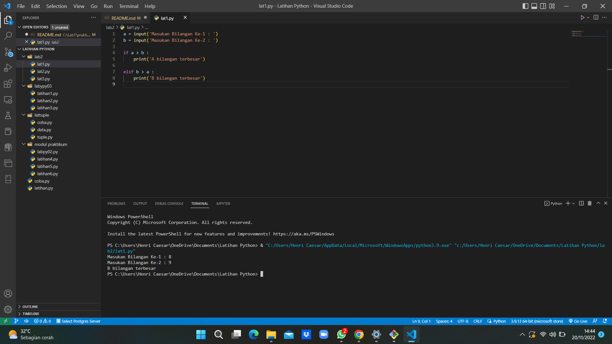

# praktikum7
# LATIHAN 1
## MEMBUAT PROGRAM DENGAN MENGINPUT 2 BUAH BILANGAN UNTUK MENENTUKAN BILANGAN TERBESAR MENGGUNAKAN STATEMENT IF
# Source Code & Output (Hasil Running Program)
Berikut ini adalah Source Code Latihan 1 :

a = input('Masukan Bilangan Ke-1 : ')
b = input('Masukan Bilangan Ke-2 : ')

if a > b :
    print('A bilangan terbesar')
    
elif b > a :
    print('B bilangan terbesar')

    

# LATIHAN 2
## MEMBUAT PROGRAM UNTUK MENGURUTKAN DATA SECARA BERURUTAN MULAI DARI DATA TERKECIL

## Source Code & Output (Hasil Running Program)
Berikut ini adalah Source Code Latihan 2 :

a, b, c = (
    int(input("Masukan nilai Ke-1: ")),
    int(input("Masukan nilai Ke-2: ")),
    int(input("Masukan nilai Ke-3: "))
)
if a< b and a < c:
    if b < c:
        print("Urutan Bilangan : ",a,b,c)
    else:
        print("Urutan Bilangan : ",a,c,b)
elif b < a and b < c:
    if a < c:
        print("Urutan Bilangan : ",b,a,c)
    else:
        print("Urutan Bilangan : ",b,c,a)
else:
    if a< b:
        print("Urutan Bilangan : ",c,a,b)
    else:
        print("Urutan Bilangan : ",c,b,a)

.png)

# LATIHAN 3
## MEMBUAT PROGRAM DENGAN PERULANGAN BERTINGKAT 

## Source Code & Output (Hasil Running Program)
Berikut ini adalah Source Code Latihan 3 :

start = 0;
stop = 10;
for i in range(10):
    for j in range(start,stop):
        print(j, sep=" ", end=" ")
        if j < 10 :
            print('{0:>2}'.format(""), end="")
        else :
            print('{0:>1}'.format(""), end="")
    start+=1
    stop+=1
    print("")

.png)

# LATIHAN 4
## MEMBUAT PROGRAM BILANGAN ACAK YANG LEBIH KECIL DARI 0.5 MENGGUNAKAN KOMBINASI WHILE DAN FOR

## Source Code & Output (Hasil Running Program)
Berikut ini adalah Source Code LATIHAN 4 :

import random

jumlah = int(input("Masukan Jumlah Nilai :"))
for i in range(jumlah):
    i=random.uniform(0.0,0.5)
    print("Data Ke:", i)
print("Selesai")
.png)

# TUGAS PRAKTIKUM 2
## MEMBUAT PROGRAM DENGAN MENGINPUT 3 BUAH BILANGAN UNTUK MENENTUKAN BILANGAN TERBESAR MENGGUNAKAN STATEMENT IF

## Source Code & Output (Hasil Running Program)
Berikut ini adalah Source Code LATIHAN 5 (PRAKTIKUM2) :

print("Praktikum2")
A = int (input("Masukkan bilangan pertama:"))
B = int (input("Masukkan bilangan kedua: "))
C = int (input("Masukkan bilangan ketiga: "))
if A > B > C :
    print("\nBilangan pertama adalah bilangan terbesar = %s" % A)
elif B > C :
    print("\nBilangan kedua adalah bilangan terbesat = %s" % B)
else :
    print("\nBilangan ketiga adalah bilangan terbesar = %s" % C)

.png)

## FLOWCHART 
1. MULAI
2. INISIASI BIL1, BIL2, BIL3 SEBAGAI INTEGER.
3. BACA BIL1.
4. BACA BIL2.
5. BACA BILL3.
6. JIKA BIL1 > BIL2 DAN BIL1 > BIL3 MAKA KERJAKAN LANGKAH 8, SELAIN ITU
7. JIKA BIL2 > BIL1 DAN BIL2 > BIL3 MAKA KERJAKAN LANGKAH 9, SELAIN ITU KERJAKAN LANGKAH 10.
8. CETAK "BILANGAN TERBESAR BILANGAN PERTAMA".
9. CETAK "BILANGAN TERBESAR BILANGAN KEDUA".
10. CETAK "BILANGAN TERBESAR BILANGAN KETIGA".
11. SELESAI.

# TUGAS PRAKTIKUM 3
## LATIHAN 2 MEMBUAT PROGRAM MENAMPILKAN BILANGAN TERBESAR DARI N SEBUAH DATA YANG DIINPUTKAN DAN MASUKKAN ANGKA 0 UNTUK BERHENTI

## Source Code & Output (Hasil Running Program)
Berikut ini adalah Source Code LATIHAN 6 (PRAKTIKUM3) :

max = 0
while True:
    a=int(input('Masukan Bilangan :'))
    if max < a:
        max = a
    if a == 0:
        break
print('\n Bilangan Terbesar Adalah :', max)

.png)

# TUGAS PRAKTIKUM 3
## MEMBUAT PROGRAM SEDERHANA DENGAN PERULANGAN

## Source Code & Output (Hasil Running Program)
Berikut ini adalah Source Code PRAKTIKUM 3 :

x=int(input('Uang Muka : '))

a=0*x
b=0*x
c=0.01*x
d=0.01*x
e=0.05*x
f=0.05*x
g=0.05*x
h=0.03*x
y=[a,b,c,d,e,f,g,h]

for i in range (len(y)):
    print("Laba Bulan Ke ",i+1,"sebesar :",y[i])

k=(a+b+c+d+e+f+g+h)
print('Jumlah Laba Selama 8 Bulan :',k)

.png)